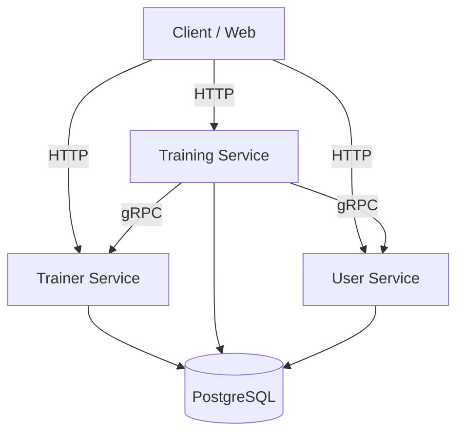

# Wild Workouts

)

**Wild Workouts** is a training-session booking platform where personal trainers publish open slots and clients book them. 

This repository serves as a hands-on exploration of **Domain-Driven Design (DDD)**, **Hexagonal Architecture (Ports & Adapters)**, and **Microservices in Go**, adapted and modernized from the original [ThreeDotsLabs Wild Workouts](https://github.com/ThreeDotsLabs/wild-workouts-go-ddd-example) example.

## Services

| Service    | HTTP port | gRPC port | Depends on              |
|------------|-----------|-----------|--------------------------|
| `trainer`  | 4000      | 4100      | —                        |
| `training` | 4200      | —         | `trainer`, `user` (gRPC) |
| `user`     | 4300      | 4400      | —                        |

Each service lives under `internal/<service>` as its own Go module (see `go.work`), following a DDD-style layout:
`domain/`, `app/` (use cases), `adapters/` (infra), `ports/` (HTTP/gRPC entrypoints). Shared code lives in
`internal/common`.

## Tech stack

- **HTTP**: [Echo](https://echo.labstack.com/), contracts defined in OpenAPI, code generated via [oapi-codegen](https://github.com/oapi-codegen/oapi-codegen)
- **gRPC**: inter-service calls, [Protobuf](https://protobuf.dev/)-defined
- **PostgreSQL**: queries generated via [sqlc](https://sqlc.dev/)
- **CI/CD**: GitHub Actions

## Test strategy

Each service's tests are split into three layers by Go build tag, from fastest/most-isolated to
slowest/most-realistic:

| Layer           | Build tag     | Where                          | What it exercises                                                                              | Needs Postgres? |
|-----------------|---------------|---------------------------------|--------------------------------------------------------------------------------------------------|-----------------|
| Unit            | _(none)_      | `domain/`                      | Pure domain logic in isolation — no DB, no network.                                              | No              |
| Integration     | `integration` | `adapters/db/`                 | Real repositories/read-models against a real Postgres instance.                                  | Yes             |
| Component       | `component`   | `tests/`                        | The service boots for real (real DB, real HTTP/gRPC servers); only external systems are stubbed — auth, and (for `training`) its gRPC calls to `trainer`/`user`. Tests drive it black-box through its generated API client. | Yes             |

